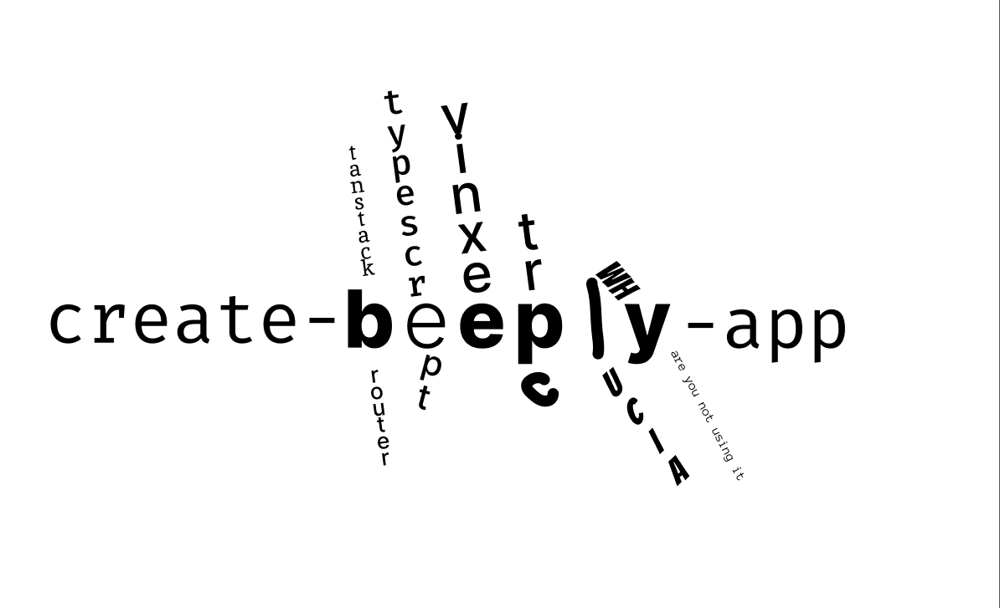

An interactive CLI to build a modular template for creating apps with the some of the technologies we use on a regular basis.

### Get started with

**npm**

```
npm create beeply-app@latest
```

**yarn**

```
yarn create beeply-app@latest
```

**pnpm**

```
pnpm create beeply-app@latest
```

### Stack

- [Vinxi](https://vinxi.vercel.app/)
- [Tanstack Router](https://tanstack.com/router/v1)
- [Prisma](https://www.prisma.io/)
- [Tailwind](https://tailwindcss.com/)
- [tRPC](https://trpc.io/)
- [Lucia Auth](https://lucia-auth.com/)
